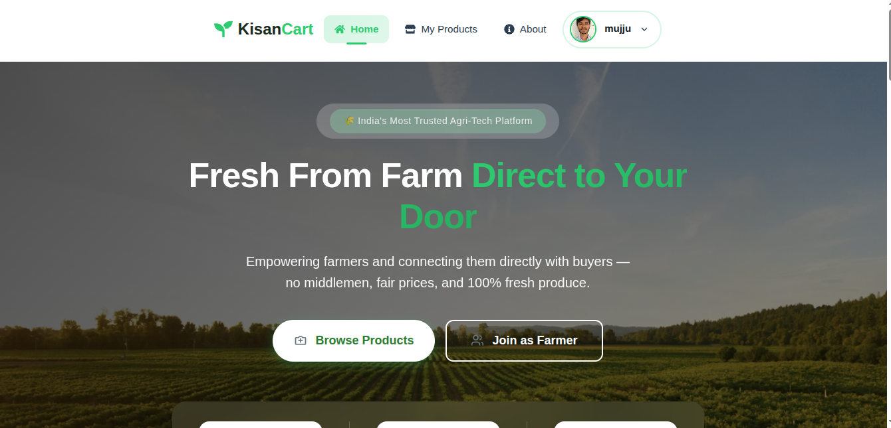
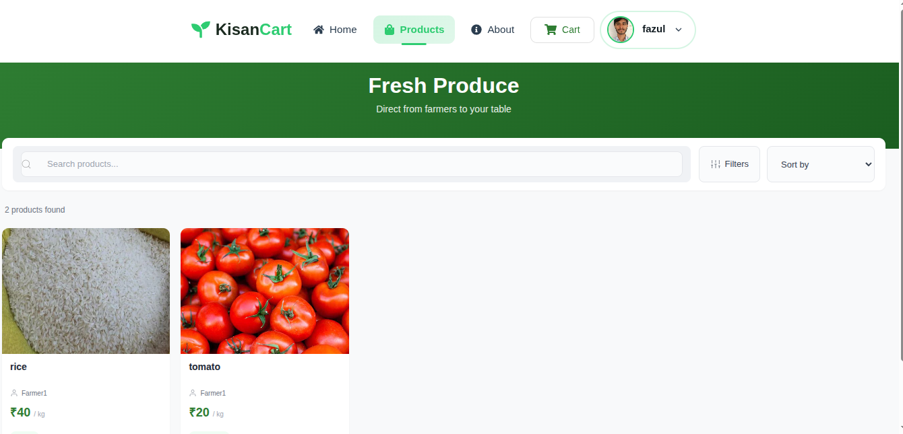
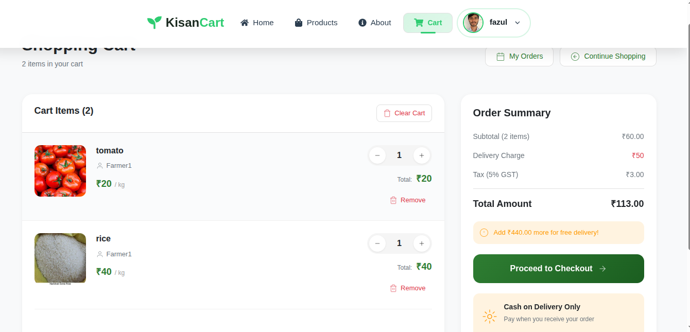
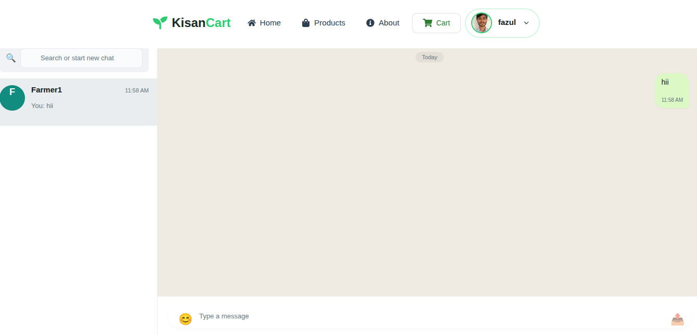
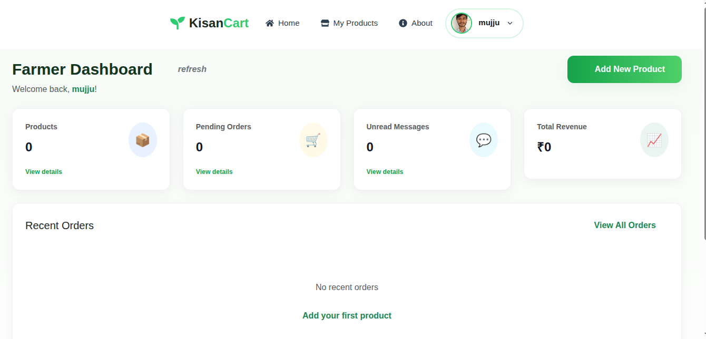
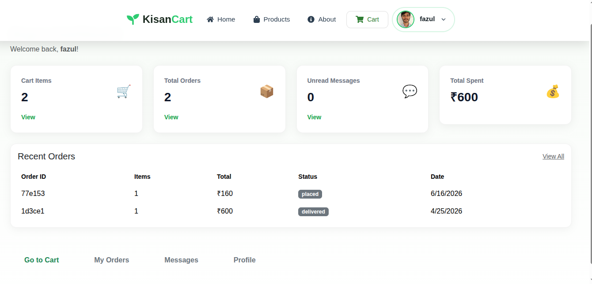

# 🌾 KisanCart – Farmer Marketplace Platform

## 🚀 Live Demo

🌐 **Website:** https://kisan-cart.vercel.app/

---

## 🚀 Overview

KisanCart is a full-stack MERN application that connects farmers directly with buyers, eliminating middlemen and enabling seamless agricultural commerce.

The platform allows farmers to manage products and orders while buyers can browse products, place orders, communicate with farmers, and track purchases in real time.

---

# ✨ Features

## 👤 Authentication & Security

* User Registration & Login
* JWT-based Authentication
* Role-Based Access (Farmer / Buyer)
* Secure Password Hashing
* Password Reset via Email

## 🧑‍🌾 Farmer Features

* Add Products
* Edit Products
* Delete Products
* Manage Product Listings
* Upload Profile Image
* View Buyer Orders
* Update Order Status
* Chat with Buyers

## 🛒 Buyer Features

* Browse Products
* Search & Filter Products
* Add Products to Cart
* Place Orders
* View Order History
* Track Orders
* Chat with Farmers

## 💬 Real-Time Messaging

* Buyer ↔ Farmer Communication
* Dedicated Chat Interface
* Instant Messaging Experience

## 📊 Dashboards

* Farmer Dashboard
* Buyer Dashboard
* Order Tracking
* Statistics Overview

## 🤖 AI Assistant

* Agriculture Guidance
* Crop Suggestions
* Fertilizer Recommendations

## 📧 Email Services

* Password Reset Emails
* Order Status Notifications

---

# 🛠️ Tech Stack

## Frontend

* React.js (Vite)
* Bootstrap 5
* Axios

## Backend

* Node.js
* Express.js
* MongoDB Atlas
* Mongoose

## Additional Tools

* JWT Authentication
* Multer
* Nodemailer

---

# 📸 Screenshots

## 🏠 Home Page

## 🛍️ Products Page

## 🛒 Cart Page

## 💬 Chat Interface

## 🌾 Farmer Dashboard

## 👤 Buyer Dashboard

---

# 🌐 Deployment

### Frontend

* Vercel

### Backend

* Render

---

# 👨‍💻 Author

**Shaik Fazul Ahammad**

📧 [fazulahammads@gmail.com](mailto:fazulahammads@gmail.com)

GitHub: https://github.com/fazul647

---

# ⭐ Conclusion

KisanCart is a real-world MERN Stack application demonstrating:

* Authentication & Authorization
* Product Management
* Shopping Cart & Orders
* Real-Time Messaging
* Email Integration
* Responsive UI Design
* Full CRUD Operations

⭐ If you found this project useful, please consider giving it a star on GitHub.
